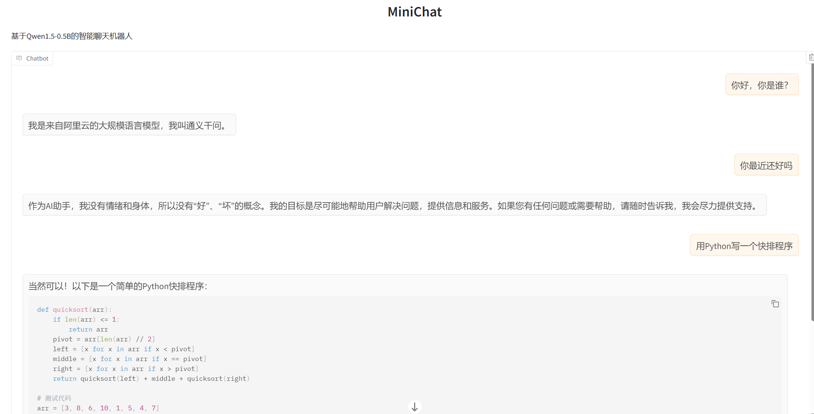

## 这是一个小型的聊天机器人项目

#### 需要的包的版本：
*python*:3.10.18 \
*gradio*:5.35.0 \
*torch*:2.7.1 \
*transformers*:4.53.0 

#### 运行：
激活环境后命令行输入：python app.py

#### 界面展示：

#### 收获：
1.知道了一个项目创建的过程 \
2.初步学会了git和.gitignore \
3.查阅资料动手修改wsl使用ubuntu可以通过主机进行反向代理，从而使用远程仓库 \ 
4.初步学会了一个模型加载和使用的过程 \
5.初步学会前端页面的简单制作,使用gradi创建简单的聊天界面

